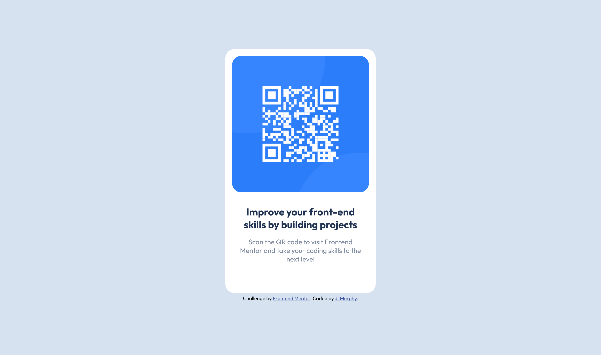

# Frontend Mentor - QR code component solution

This is a solution to the [QR code component challenge on Frontend Mentor](https://www.frontendmentor.io/challenges/qr-code-component-iux_sIO_H). Frontend Mentor challenges help you improve your coding skills by building realistic projects. 

## Table of contents

- [Overview](#overview)
  - [Screenshot](#screenshot)
  - [Links](#links)
- [My process](#my-process)
  - [Built with](#built-with)
  - [What I learned](#what-i-learned)
  - [Continued development](#continued-development)
  - [Useful resources](#useful-resources)
- [Author](#author)
- [Acknowledgments](#acknowledgments)

**Note: Delete this note and update the table of contents based on what sections you keep.**

## Overview

### Screenshot



### Links

- Solution URL: https://github.com/jenmurph4610/QR_Code_Component.git
- Live Site URL: https://jenmurph4610.github.io/QR_Code_Component/

## My process

I started this project with the basic HTML.  From there I added the CSS colors, fonts, and the border radius.  From there I set out to ajust positioning and sizing to match the example images.  Initially seeing screenshots for both mobile and desktop I thought I might have to do media queries, but then after some thought I realized that was not necessary as long as the div was prositioned properly the same layout will work for both.

### Built with

- Semantic HTML5 markup
- CSS custom properties

### What I learned

I am getting better with CSS, although aligning things the way I want still seems to take me some time of trial and error with the properties.  I usually end up feeling like I did it the long way and that I am missing some much simpler method.  For example in the H1 and P selectors of this project (snipped below).  I would love some thoughts on if there are more streamlined methods than what I used here.  

```css
h1 {
    color: hsl(218, 44%, 22%);
    font-size: 22px;
    width: 90%;
    text-align: center;
    margin-left: auto;
    margin-right: auto;
    padding-top: 10px;
}

p {
    color: hsl(220, 15%, 55%);
    font-size: 15px;
    text-align: center;
    width: 90%;
    margin-left: auto;
    margin-right: auto;
}
```

### Continued development

Related to this project I would like to continue to improve my CSS skills, specificly when it comes to positioning and the various display types.  


## Author

- Frontend Mentor - [@jenmurph4610](https://www.frontendmentor.io/profile/jenmurph4610)


